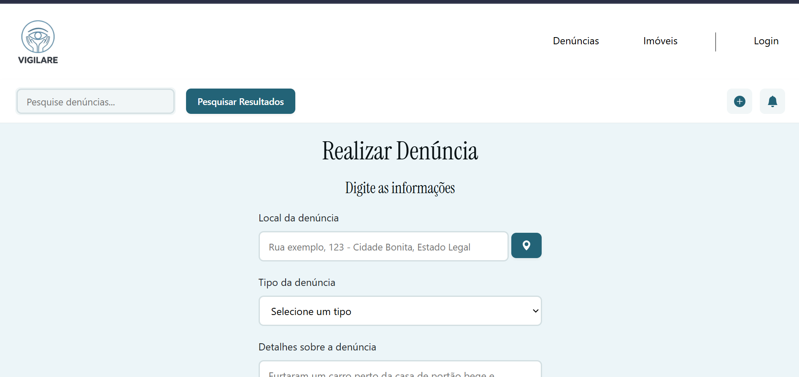
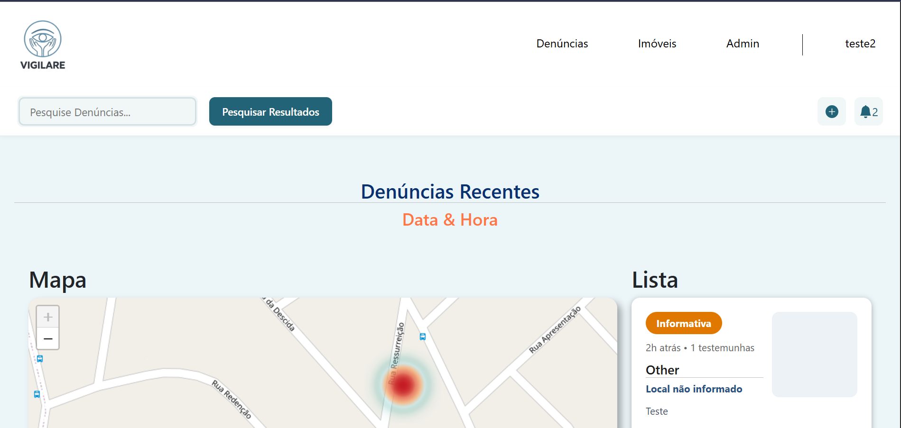
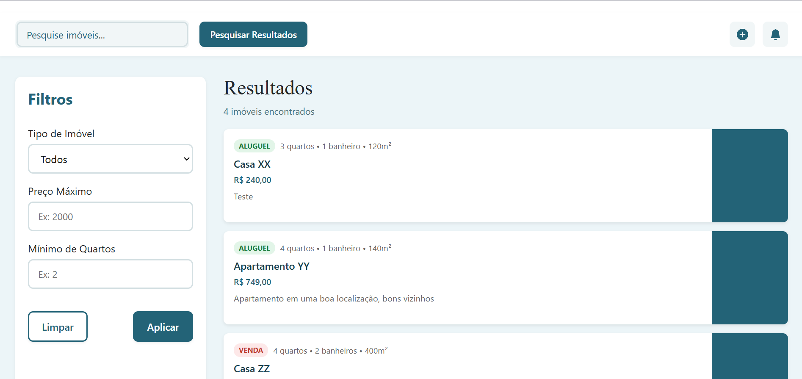
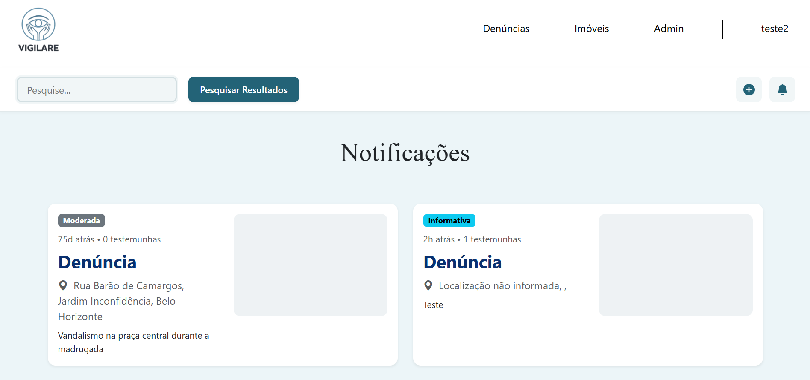

# Introdução

Informações básicas do projeto.

- **Projeto:** Vigilare
- **Repositório GitHub:** [Github](https://github.com/ICEI-PUC-Minas-PMGES-TI/pmg-es-2026-1-ti1-0438100-sentinelas/tree/master)
- **Membros da equipe:**
  - [Arthur Estevão](https://github.com/ArthurEstevaoST)
  - [Bernardo Ramos](https://github.com/bernardorf5)
  - [Francisco Filipe](https://github.com/franciscofilipeee)
  - [Gabriel de Oliveira](https://github.com/Biels2w)
  - [João Pedro](https://github.com/jpommoura)
  - [Sophia Nicole](https://github.com/sophiaferreira1a)
  - [Victor Dante](https://github.com/victordante666)

## Sumário

- [Introdução](#introdução)
  - [Sumário](#sumário)
- [Contexto](#contexto)
  - [Problema](#problema)
  - [Objetivos](#objetivos)
  - [Justificativa](#justificativa)
  - [Público-Alvo](#público-alvo)
- [Product Discovery](#product-discovery)
  - [Etapa de Entendimento](#etapa-de-entendimento)
  - [Etapa de Definição](#etapa-de-definição)
    - [Personas](#personas)
- [Product Design](#product-design)
  - [Histórias de Usuários](#histórias-de-usuários)
  - [](#)
  - [Requisitos](#requisitos)
    - [Requisitos Funcionais](#requisitos-funcionais)
    - [Requisitos não Funcionais](#requisitos-não-funcionais)
  - [Projeto de Interface](#projeto-de-interface)
    - [Wireframes](#wireframes)
    - [User Flow](#user-flow)
    - [Protótipo Interativo](#protótipo-interativo)
- [Metodologia](#metodologia)
  - [Gerenciamento do Projeto](#gerenciamento-do-projeto)
- [Solução Implementada](#solução-implementada)
  - [Vídeo do Projeto](#vídeo-do-projeto)
  - [Funcionalidades](#funcionalidades)
        - [Funcionalidade 1 - Exibição/Cadastro de Denúncias](#funcionalidade-1---exibiçãocadastro-de-denúncias)
        - [Funcionalidade 2 - Exibição/Cadastro de Imóveis](#funcionalidade-2---exibiçãocadastro-de-imóveis)
        - [Funcionalidade 3 - Painel Administrativo](#funcionalidade-3---painel-administrativo)
        - [Funcionalidade 4 - Exibição das notificações](#funcionalidade-4---exibição-das-notificações)
  - [Estruturas de Dados](#estruturas-de-dados)
        - [Estrutura de Dados - Denúncias](#estrutura-de-dados---denúncias)
        - [Estrutura de Dados - Imóveis](#estrutura-de-dados---imóveis)
        - [Estrutura de Dados - Notificações](#estrutura-de-dados---notificações)
        - [Estrutura de Dados - Usuários](#estrutura-de-dados---usuários)
        - [Estrutura de Dados - Denúncia de testemunhas](#estrutura-de-dados---denúncia-de-testemunhas)
  - [Módulos e APIs](#módulos-e-apis)
- [Referências](#referências)

---

# Contexto

O projeto Vigilare é uma iniciativa desenvolvida no contexto de crescente preocupação com a segurança pública em Belo Horizonte. O projeto nasceu da necessidade de combater o aumento significativo de crimes, que afetam a população em geral e demandam uma resposta inovadora e colaborativa.

Este documento constitui a documentação da fase estratégica do projeto, contendo a análise detalhada do problema, os objetivos propostos, o público-alvo identificado, e o processo de descoberta e design do produto que orientará o desenvolvimento da solução tecnológica.

---

## Problema

O Brasil enfrenta uma crise significativa de segurança pública caracterizada pelo aumento exponencial de crimes contra o patrimônio. Utilizando como base os dados da Secretaria de Estado de Justiça e Segurança Pública de Belo Horizonte, indicam que de janeiro a abril de 2025, a capital mineira registrou 23.541 ocorrências de furto, representando uma média diária de 196 casos.

Especificamente, o furto de celulares apresenta taxas alarmantes: durante o período de carnaval de 2025, foram registrados aproximadamente 200 aparelhos roubados ou furtados por dia. De janeiro a março do mesmo ano, o volume chegou a 5.734 ocorrências apenas para esta categoria.

As análises das causas do aumento criminal apontam para três fatores principais:

- **Ruas mais "calmas":** A redução da movimentação em determinadas áreas cria oportunidades para atividades criminosas com menor risco de intervenção.

- **Impotência da sociedade:** A população carece de mecanismos eficazes para reportar crimes, compartilhar informações sobre incidentes e coordenar respostas coletivas.

- **Baixa atuação da força policial:** A capacidade operacional insuficiente das instituições de segurança limita a resposta imediata e preventiva.

---

## Objetivos

Desenvolver uma aplicação web e mobile que permita aos cidadãos de um mesmo bairro ou cidade compartilhar informações sobre crimes, testemunhas e evidências, integrando essas informações diretamente com as instituições de segurança pública para facilitação de respostas rápidas e coordenadas.

1. **Facilitar o compartilhamento de informações sobre crimes:** Criar uma rede de vigilância colaborativa entre moradores e comerciantes de uma mesma região que aumente a conscientização sobre riscos locais.

2. **Integrar os dados coletados com as instituições de segurança pública:** Permitir que as forças policiais acessem informações relevantes em tempo real para melhor direcionamento de operações preventivas e repressivas.

3. **Ampliar a acessibilidade tecnológica:** Garantir que usuários com diferentes níveis de familiaridade com tecnologia possam utilizar a plataforma de forma intuitiva e sem barreiras.

---

## Justificativa

A escolha do Vigilare como tema de desenvolvimento justifica-se por sua relevância social e urgência. O projeto aborda um problema que afeta diretamente a qualidade de vida de milhões de cidadãos e representa uma oportunidade de demonstrar como tecnologia e design podem contribuir para o bem público.

A insegurança crônica prejudica não apenas a integridade patrimonial dos indivíduos, mas também sua saúde mental e sua liberdade de circulação. A solução proposta busca restaurar o sentimento de segurança por meio da colaboração e transparência.

O desenvolvimento do Vigilare é viável através de tecnologias consolidadas e acessíveis, incluindo arquiteturas web escaláveis, APIs de geolocalização, e integração com sistemas de dados públicos. As tecnologias selecionadas serão detalhadas na seção Metodologia.

A implementação do Vigilare tem potencial para reduzir em até 30% os crimes contra o patrimônio em áreas piloto, conforme evidências de aplicações similares em outras cidades brasileiras. Além disso, pode servir como modelo replicável para outras municipalidades.

---

## Público-Alvo

O Vigilare é projetado para servir uma população heterogênea, variando desde usuários com baixíssima familiaridade com tecnologia até profissionais que trabalham nesta área. A seguir, descrevem-se os principais segmentos do público-alvo:

- **Moradores e Comerciantes Comuns:** Indivíduos que vivem ou trabalham em uma região específica, com variados níveis de escolaridade e familiaridade com tecnologia, buscando contribuir para a segurança comunitária.

- **Cidadãos Familiarizados com a Tecnologia:** Usuários que atuarão como promotores da plataforma e contribuirão com análises mais sofisticadas de dados.

- **Força Policial:** Agentes e instituições de segurança que utilizarão a plataforma como ferramenta de inteligência operacional.

- **Gestores Públicos:** Administradores municipais e estaduais interessados em dados sobre criminalidade para planejamento estratégico.

- **Corretoras de Imóveis:** Profissionais que utilizam a plataforma para assessoramento sobre segurança em bairros.

---

# Product Discovery

## Etapa de Entendimento

A Matriz CSD foi utilizada para organizar o conhecimento e facilitar a tomada de decisão sobre os requisitos da solução:

| Certezas                              | Suposições                                | Dúvidas                                   |
| ------------------------------------- | ----------------------------------------- | ----------------------------------------- |
| Há um problema real de criminalidade  | Cidadãos querem contribuir para segurança | Qual será o nível de adoção inicial?      |
| Tecnologia pode facilitar colaboração | Usuários farão registros consistentemente | Como garantir confiabilidade dos relatos? |
|                                       | Dados ajudarão polícia a reduzir crimes   | Qual será a frequência de uso?            |
|                                       | Interface simples será adotada por todos  |                                           |

Os principais stakeholders do projeto foram mapeados conforme sua influência e interesse:

| Stakeholder                | Interesse/Influência                   |
| -------------------------- | -------------------------------------- |
| Cidadãos Comuns            | Alto interesse, média-alta influência  |
| Força Policial             | Alto interesse, muito alta influência  |
| Gestão Municipal           | Médio interesse, muito alta influência |
| Tecnólogos/Desenvolvedores | Alto interesse, média influência       |

Foram realizadas análises de dados públicos e revisão de literatura sobre segurança urbana. Os principais achados:

- De janeiro a abril de 2025: 23.541 furtos em BH (média de 196/dia)
- Março de 2025: mês com maior incidência (6.740 casos)
- Furto de celulares: 5.734 em 3 meses (200/dia durante o carnaval)
- Locais críticos: hipercentro, semáforos, transportes coletivos, saídas de bares
- Perfil dos infratores: dependentes de drogas, pessoas em situação de rua, especialistas
- Fenômeno de receptação alimenta a cadeia criminal

## Etapa de Definição

### Personas


---

# Product Design

Nesse momento, vamos transformar os insights e validações obtidos em soluções tangíveis e utilizáveis. Essa fase envolve a definição de uma proposta de valor, detalhando a prioridade de cada ideia e a consequente criação de wireframes, mockups e protótipos de alta fidelidade, que detalham a interface e a experiência do usuário.

## Histórias de Usuários

Com base na análise das personas foram identificadas as seguintes histórias de usuários:

| EU COMO...`PERSONA`  | QUERO/PRECISO ...`FUNCIONALIDADE`                             | PARA ...`MOTIVO/VALOR`                                   |
| -------------------- | ------------------------------------------------------------- | -------------------------------------------------------- |
| Morador/Comerciante  | Denunciar crimes que acontecem na região                      | Alertar as pessoas sobre crimes próximos                 |
| Morador/Comerciante  | Visualizar denúncias feitas por outros moradores/comerciantes | Saber o que está acontecendo na minha região             |
| Morador/Comerciante  | Apoiar denúncias dos vizinhos                                 | Tornar a denúncia mais relevante com mais testemunhas    |
| Morador/Comerciante  | Editar, excluir e visualizar minhas denúncias                 | Corrigir eventuais erros nas denúncias                   |
| Vendedor imobiliário | Visualizar estatísticas de criminalidade                      | Precificar imóveis com base na segurança da região       |
| Policial             | Visualizar denúncias mais relevantes                          | Priorizar ações e atender melhor a população             |
| Morador/Comerciante  | Visualizar mapa de calor (mapa de cores)                      | Identificar áreas perigosas e definir rotas mais seguras |
| Corretora de imóveis | Checar áreas residenciais mais seguras                        | Indicar os melhores bairros para seus clientes           |

##


---

## Requisitos

As tabelas que se seguem apresentam os requisitos funcionais e não funcionais que detalham o escopo do projeto.

### Requisitos Funcionais

| ID     | Descrição do Requisito                                                                                                                              | Prioridade |
| ------ | --------------------------------------------------------------------------------------------------------------------------------------------------- | ---------- |
| RF-001 | Cadastrar denúncias de crimes: O sistema deve permitir que moradores e comerciantes registrem ocorrências com dados e evidências.                   | ALTA       |
| RF-002 | Geolocalização de incidentes: O usuário deve ser capaz de marcar o local exato do crime no mapa durante o fluxo de denúncia.                        | ALTA       |
| RF-003 | Visualizar mapa de calor/crimes: O sistema deve exibir um mapa interativo com a localização e intensidade das ocorrências por região.               | ALTA       |
| RF-004 | Autenticação de usuários: Permitir login, registro e validação de usuários comuns e perfis especiais (polícia/gestores).                            | ALTA       |
| RF-005 | Apoiar denúncias (Testemunhas): Permitir que usuários adicionem relatos ou confirmem denúncias de terceiros para aumentar a relevância do registro. | MÉDIA      |
| RF-006 | Gestão de denúncias próprias: O usuário deve poder editar, excluir e visualizar seu histórico de denúncias realizadas.                              | MÉDIA      |
| RF-007 | Dashboard Analítico e Relatórios: Fornecer painéis de dados, filtros regionais e exportação de estatísticas para forças policiais e gestores.       | MÉDIA      |
| RF-008 | Notificações em tempo real: Enviar alertas de segurança e atualizações de incidentes próximos à localização do usuário.                             | BAIXA      |

### Requisitos não Funcionais

| ID      | Descrição do Requisito                                                                                                                                    | Prioridade |
| ------- | --------------------------------------------------------------------------------------------------------------------------------------------------------- | ---------- |
| RNF-001 | Multiplataforma/Responsividade: A aplicação deve ser acessível via web e dispositivos móveis (Android/iOS).                                               | ALTA       |
| RNF-002 | Usabilidade/Acessibilidade: A interface deve ser intuitiva para usuários com diferentes níveis de literacia tecnológica (ex: botões grandes para idosos). | ALTA       |
| RNF-003 | Escalabilidade: A infraestrutura (Google Cloud) deve suportar o crescimento do volume de dados e acessos simultâneos.                                     | ALTA       |
| RNF-004 | Confiabilidade dos dados: O sistema deve possuir mecanismos para validar a veracidade dos relatos e reduzir "ruídos" ou denúncias falsas.                 | ALTA       |
| RNF-005 | Segurança e Privacidade: Garantir a integridade das informações e o acesso restrito a dados sensíveis por perfis autorizados (ex: dashboard policial).    | MÉDIA      |
| RNF-006 | Performance: Integração eficiente com APIs de geolocalização (Google Maps) para carregamento rápido dos mapas de incidentes.                              | MÉDIA      |

## Projeto de Interface

Artefatos relacionados com a interface e a interacão do usuário na proposta de solução.

### Wireframes

Os wireframes foram desenvolvidos utilizando ferramentas de prototipagem (Excalidraw e Figma), representando as principais telas da aplicação:

- **Homepage:** Apresenta a proposta de valor e opções de login/cadastro

  

- **Realizar Denúncia:** Formulário para preenchimento de dados de denúncia com geolocalização

  

- **Meu Perfil:** Visualização e edição de informações do usuário

  

- **Denúncias:** Feed de denúncias com filtros e detalhes

  

- **Notificações:** Centro de notificações com alertas e atualizações

  

### User Flow

Um protótipo interativo foi desenvolvido permitindo ao usuário navegar pelas funcionalidades como se estivesse lidando com o software pronto. O protótipo foi construído utilizando Figma e pode ser acessado através do seguinte link:

**[User Flow - Figma](https://www.figma.com/design/hZV6VQyhKt3hQ1hpg6199s/TIAW-Interface?node-id=131-68&t=2BesBlw9wMAW2h04-0)**

---

### Protótipo Interativo

**[Protótipo Interativo - Figma](https://www.figma.com/design/hZV6VQyhKt3hQ1hpg6199s/TIAW-Interface?node-id=131-68&t=2BesBlw9wMAW2h04-0)**

# Metodologia

Detalhes sobre a organização do grupo e o ferramental empregado.

| Ambiente                    | Plataforma | Link de acesso                                                                                         |
| --------------------------- | ---------- | ------------------------------------------------------------------------------------------------------ |
| Processo de Design Thinking | Miro       | https://miro.com/app/board/uXjVGtt_X9U=/?share_link_id=672081213527                                    |
| Repositório de código       | GitHub     | https://github.com/ICEI-PUC-Minas-PMGES-TI/pmg-es-2026-1-ti1-0438100-sentinelas/tree/master            |
| Hospedagem do site          | Render     |                                                                                                        |
| Protótipo Interativo        | Figma      | https://www.figma.com/design/hZV6VQyhKt3hQ1hpg6199s/TIAW-Interface?node-id=131-68&t=2BesBlw9wMAW2h04-0 |
|                             |            |                                                                                                        |

## Gerenciamento do Projeto

Divisão de papéis no grupo e apresentação da estrutura da ferramenta de controle de tarefas (Kanban).

- **Arthur Estevão** - Developer
- **Bernardo Ramos** - Developer
- **Francisco Filipe** - Scrum Master
- **Gabriel de Oliveira** - Developer
- **João Pedro** - Developer
- **Sophia Nicole** - Product Owner
- **Victor Dante** - Developer


---

# Solução Implementada

Esta seção apresenta todos os detalhes da solução criada no projeto.

## Vídeo do Projeto

O vídeo a seguir traz uma apresentação do problema que a equipe está tratando e a proposta de solução. ⚠️ EXEMPLO ⚠️

[](https://drive.google.com/file/d/1FIZpFvBLhShW3mWlymxxAwrwKCMEOgNd/view)

## Funcionalidades

Esta seção apresenta as funcionalidades da solução.Info

##### Funcionalidade 1 - Exibição/Cadastro de Denúncias
Permite o cadastro de uma denúncia por um usuário e visualizar as denúncias no geral

- **Estrutura de dados:** [Denúncias]
- **Instruções de acesso:**
  - Abra o site
  - Acesse a página de Denúncias para ver as denúncias feitas
  - Em seguida, clique no botão "+" no canto superior direito da página para adicionar uma nova denúncia
- **Tela da funcionalidade**:



##### Funcionalidade 2 - Exibição/Cadastro de Imóveis
Permite o cadastro de um imóvel por um corretor e visualizar os imóveis no geral

- **Estrutura de dados:** [Imóveis]
- **Instruções de acesso:**
  - Abra o site
  - Faça o login como corretor e acesse a página de Imóveis para ver os imóveis cadastrados
  - Em seguida, clique no botão "+" no canto superior direito da página para adicionar um novo imóvel
- **Tela da funcionalidade**:


##### Funcionalidade 3 - Painel Administrativo
Permite a verificação de denúncias para futura exibição no site por um administrador

- **Estrutura de dados:** [Denúncias]
- **Instruções de acesso:**
  - Abra o site
  - Faça o login como administrador e acesse a página Admin
- **Tela da funcionalidade**:


##### Funcionalidade 4 - Exibição das notificações 
Permite a visualização de notificações recentes de denúncias realizadas

- **Estrutura de dados:** [Notificações]
- **Instruções de acesso:**
  - Abra o site
  - Acesse a página de denúncias ou imóveis
- **Tela da funcionalidade**:


## Estruturas de Dados

Descrição das estruturas de dados utilizadas na solução com exemplos no formato JSON.Info

##### Estrutura de Dados - Denúncias 

Denúncias cadastradas na aplicação

```json
{
  "id": "1",
  "type": "theft",
  "description": "Crime ocorreu com o carro placa XYZ-1234",
  "location": {
    "lat": -19.907755,
    "lng": -43.9954089
  },
  "date": "2026-04-17T12:00:00Z",
  "witness_count": 4,
  "testemunhas": [],
  "relevancy": "urgent",
  "user_id": 1,
  "status": "open",
  "comentarios": [],
  "verificado": false
}
```

##### Estrutura de Dados - Imóveis

Propriedades cadastradas na aplicação

```json
{
  "nome": "Casa XX",
  "local": "Rua das Flores, 233",
  "cidade": "belohorizonte",
  "tipo": "aluguel",
  "preco": 240,
  "quartos": 3,
  "banheiros": 1,
  "tamanho": "120m²",
  "descricao": "Teste",
  "fotos": [],
  "dataCadastro": "30/05/2026",
  "id": "za9GPlVvGQI"
}
```

##### Estrutura de Dados - Notificações

Notificações da aplicação

```json
{
  "id": "2",
  "user_id": 2,
  "type": "complaint_update",
  "description": "Sua denúncia foi atualizada",
  "date": "2026-04-16T18:30:00Z",
  "read": true
}
```

##### Estrutura de Dados - Usuários 

Registro dos usuários do sistema utilizados para login e para o perfil do sistema

```json
{
  "nome": "teste",
  "email": "teste123@gmail.com",
  "senha": "teste1234",
  "cpf": "420.824.860-28",
  "perfil": "corretor",
  "id": "4g1L6pfq5s0"
}
```

##### Estrutura de Dados - Denúncia de testemunhas 

Registro dos depoimentos de outros usuários nos detalhes de cada denúncia

```json
{
  "id": "1",
  "denuncia_id": "1",
  "usuario_id": 2,
  "depoimento": "Vi o furto acontecer por volta do meio-dia. O carro estava estacionado na rua.",
  "enviadoEm": "2026-04-17T13:00:00Z"
}
```

## Módulos e APIs

Esta seção apresenta os módulos e APIs utilizados na solução

**Fonts:**

- Playfair Font - [https://fontawesome.com/](https://fonts.google.com/specimen/Playfair+Display)

**Scripts:**

- Bootstrap 5 - [http://getbootstrap.com/](http://getbootstrap.com/)
- Bootstrap Icons - [https://icons.getbootstrap.com/](https://icons.getbootstrap.com/)
- Openstreetmap - [https://www.openstreetmap.org/](https://www.openstreetmap.org/)
- Openstreetmap - [https://leafletjs.com/](https://leafletjs.com/)

# Referências

1. ABNT NBR 6023. Informação e documentação - Referências - Elaboração. Rio de Janeiro: ABNT, 2018.

2. BRASIL. Secretaria de Estado de Justiça e Segurança Pública de Minas Gerais. Dados de criminalidade em Belo Horizonte (2025).

3. O TEMPO - Artigo sobre 8 furtos por hora em BH (23/05/2025)

4. O TEMPO - Artigo sobre moradores denunciando insegurança (10/06/2025)

5. Estado de Minas - Artigo sobre 272 furtos de celulares por dia no carnaval (06/03/2025)

---
